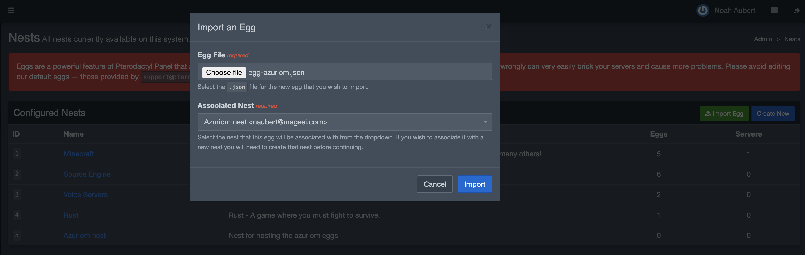
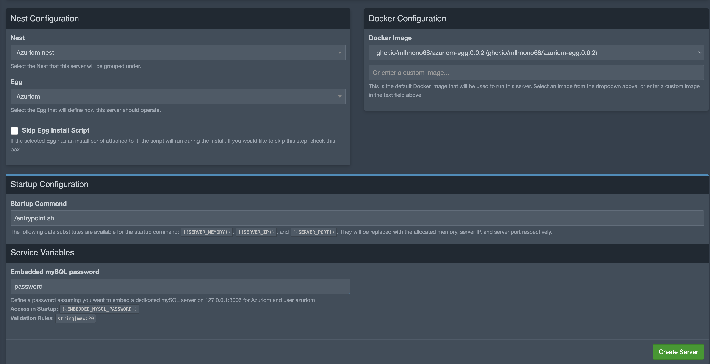
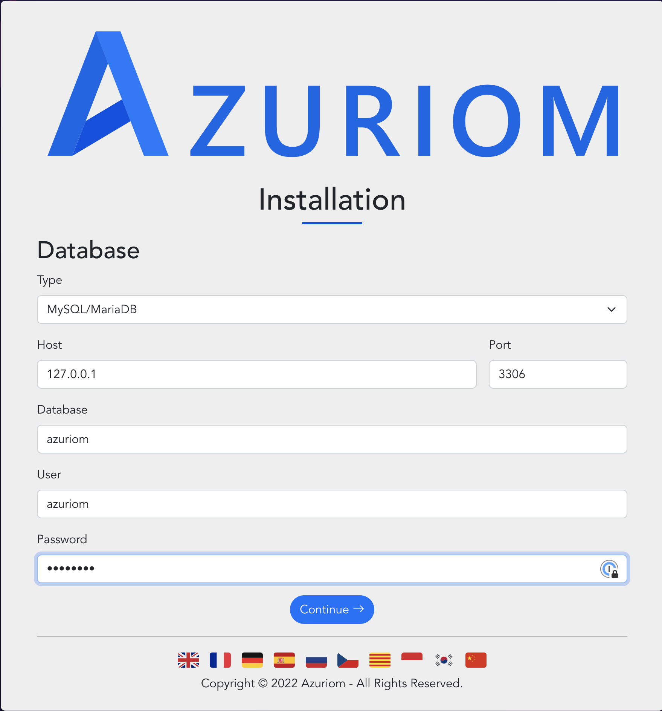

# azuriom-egg
`azuriom-egg` is a ready-to-use 
[Pterodactyl](https://pterodactyl.io/) egg with docker image allowing easy setup and integration with [Azuriom](https://azuriom.com/).

# How to install and use the egg ?
1) Simply import the egg file [egg-azuriom.json](./egg-azuriom.json) into one of your Pterodactyl nest



2) Create your server and bind it to an allocation that will handle the web traffic. If you have a database host available, create a database for your Azuriom server. Otherwise, define a value for `EMBEDDED_MYSQL_PASSWORD` and an embedded database will be created for you with this password for the `azuriom` user.


# Contributing

## How to build ?
```shell
docker build -t azuriom-egg .
```

## How to build and run locally ?
The following command will simulate the execution of the Azuriom docker image outside of Pterodactyl by :

- Persisting state into `./container` directory
- Exposing Azuriom web site on port `2000`
- Setting up a MariaDB database in the same container to avoid any external dependency by providing a value for `EMBEDDED_MYSQL_PASSWORD` environment variable

```shell
sudo rm -rf ./container && \
    mkdir -p ./container && \
    docker build -t azuriom-egg . && \
    docker run -p 2000:2000 --env SERVER_IP=0.0.0.0 --env SERVER_PORT=2000 --env EMBEDDED_MYSQL_PASSWORD=password --read-only -v $PWD/container:/home/container -it azuriom-egg
```

While setting up Azuriom on http://localhost:2000, the following database configuration can be set :

|Database config field|Value to use|
|-|-|
|Type|MySql/MariaDB|
|Host|127.0.0.1|
|Port|3306|
|Database|`azuriom`|
|User|`azuriom`|
|Password|`password`|


